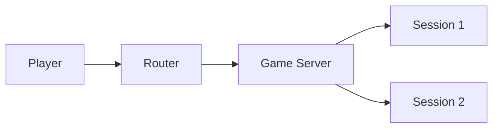

### Kubernetes Approach Summary: Instant Game Server Creation  

#### Core Concept  
**"One-Click, One-Pod" Architecture:**  
Every "New Game" click triggers Kubernetes to launch a dedicated game server instance (pod) in under 2 seconds.  

---

### Key Components  
1. **Docker Image**  
   - Your game server code packaged as a container (e.g., `game-server:v1`)  

2. **Kubernetes Objects**  
   - **Pods:** Isolated game instances (1 pod = 1 game session)  
   - **Deployment:** Blueprint for spawning pods  
   - **Service/Ingress:** Routes players to their specific pod  

3. **Control Script**  
   - Backend service that calls Kubernetes API on "New Game" events  

---

### Workflow  
1. **Player Action**  
   ```javascript  
   // Frontend  
   axios.post("/api/new-game", { playerId: "user123" });  
   ```  

2. **Backend Triggers K8s**  
   ```python  
   # Backend (Python example)  
   from kubernetes import client  
   def create_game_pod(player_id):  
       pod_manifest = {  
           "metadata": {"name": f"game-{player_id}"},  
           "spec": {  
               "containers": [{  
                   "name": "game-server",  
                   "image": "your-registry/game-server:v1",  
                   "ports": [{"containerPort": 8080}]  
               }]  
           }  
       }  
       k8s_api.create_namespaced_pod(namespace="default", body=pod_manifest)  
   ```  

3. **Kubernetes Response**  
   - Spins up new pod in 1-3 seconds  
   - Assigns unique IP (e.g., `10.1.23.45`)  

4. **Player Connection**  
   ```javascript  
   // Frontend receives response:  
   { wsUrl: "wss://games.yourdomain.com/session/user123" }  
   ```  

5. **Routing Magic**  
   ```yaml  
   # Ingress Configuration  
   apiVersion: networking.k8s.io/v1  
   kind: Ingress  
   metadata:  
     name: game-ingress  
     annotations:  
       nginx.ingress.kubernetes.io/rewrite-target: /$2  
   spec:  
     rules:  
     - http:  
         paths:  
         - path: /session/(.*)  
           pathType: Prefix  
           backend:  
             service:  
               name: game-service  
               port:  
                 number: 80  
   ```  

---

### Critical Advantages  
| Feature | Benefit |  
|---------|---------|  
| **Auto-Healing** | Restarts crashed game sessions |  
| **Scaling** | Add nodes to handle 1000+ concurrent games |  
| **Isolation** | Game crash ≠ entire server down |  
| **Rolling Updates** | Update game logic with zero downtime |  

---

### Hard Truths (Be Aware!)  
1. **Cold Start Delay**  
   - First pod: 3-5 sec (image pull)  
   - Subsequent: 1-2 sec (still noticeable)  

2. **Resource Vampires**  
   - Each pod needs:  
     - 0.5 vCPU + 512MB RAM (minimum)  
     - Multiply by concurrent players!  

3. **Networking Complexity**  
   - Requires:  
     - CNI plugins (Calico/Flannel)  
     - LoadBalancer ($$$)  
     - DNS configuration  

---

### When To Use This?  
✅ **Massive-scale games** (1000+ concurrent sessions)  
✅ **Enterprise-grade resilience** needed  
✅ **Team with K8s expertise** available  

❌ **Small projects** (use serverless instead)  
❌ **Solo developers** (steep learning curve)  
❌ **Low-latency requirements** (pod spin-up adds delay)  

### Pro Alternative  
**Shared-Server Model:**  

- Single pod handles multiple sessions  
- 100x simpler with equal performance for small/medium games  

Want the Kubernetes YAML files? Or prefer the simpler shared-server code sample?